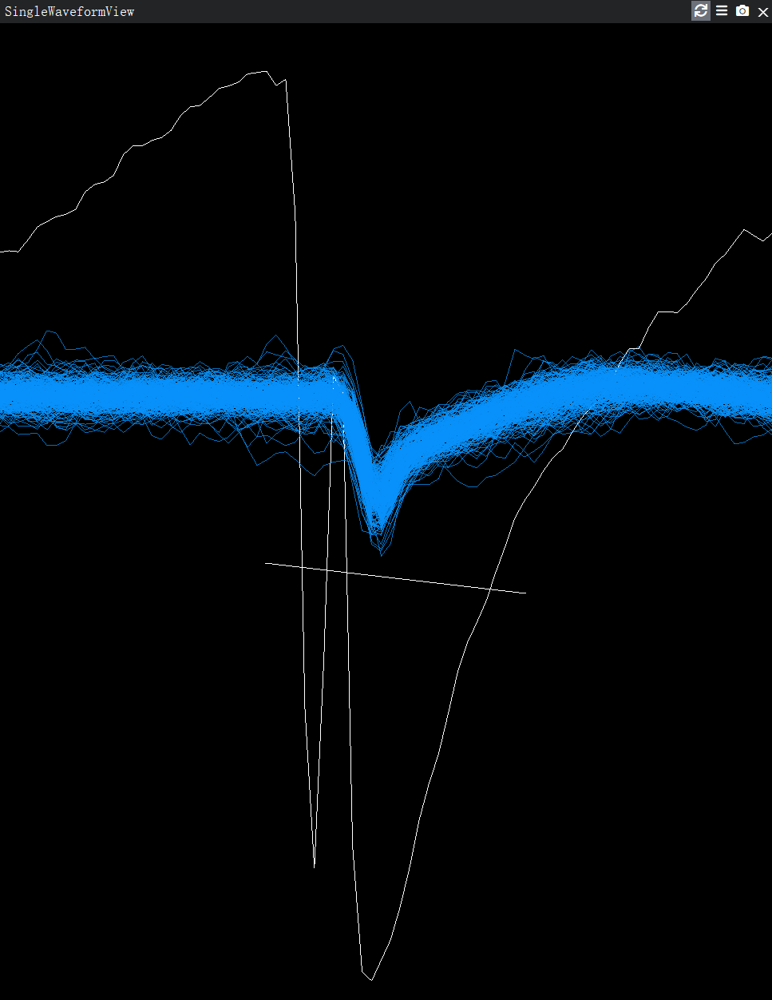
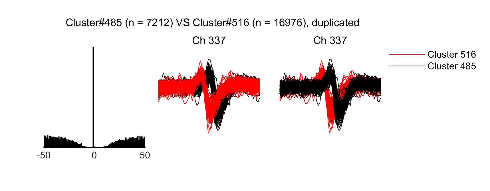

# Documentation for AutoCurationKilosort

## Important notes

- It is advised to use this tool and then validate the results in `phy` afterwards, especially for the small datasets or first time users.
- The default parameters are determined with rat cortex data. You can modify the parameters based on the properties of your data such as recordings from striatum.
- It is good to set the `verbose` parameter to `true` to visualize the results in the `Fig` folder until you are confident with the process. The figures will be saved in the `Fig` folder. Then you can set it to `false` to speed up the process.

## Pipeline

- 1. Remove the units with low firing rate (default: 0.05 Hz) and low SNR (default: 3)
- 2. Remove the outliers inside each cluster in the 2D PC-feature space. MAD is used to compute the outliers (default: 5). A good spike should not be detected as outlier in any dimension.
- 3. (optional) Detect potential splits and merges. This step does not modify the data. The user can choose to split or merge the units manually in phy.
- 4. Remove duplicated units. Two units are considered duplicated if they have an overlap in spike times (default: 10% of spikes within 0.5 ms) and the same channel that has the largest amplitude. The unit with less spikes will be removed in the duplicated pairs.
- 5. Compute the quality metrics for each unit. The [metrics](https://allensdk.readthedocs.io/en/latest/_static/examples/nb/ecephys_quality_metrics.html) include "ISI violations", "Amplitude cutoffs", "Presence ratio", "Median Amplitude", "Isolation distance", "D prime", "Nearest-neighbor miss rate" "Nearest-neighbor hit rate" and "L ratio".
- 6. Label the units as 'good' or 'mua' based on the quality metrics and user-defined criteria. The default criteria are:
  - "good":
    - isi_violations < 0.05
    - presence_ratio > 0.95
    - amplitude_cutoffs < 0.05
    - nn_hit_rate > 0.80
  - "mua":
    - isi_violations < 0.5
    - presence_ratio > 0.9
    - amplitude_cutoffs < 0.1
- 7. Realign the spike times of each cluster to center the troughs of the waveforms.

## Usage

- Edit the `settings.json` file to set the curation parameters

- Copy `AutoCurationKilosort.m` to the your data folder. Edit the installation path in the script.

```MATLAB
path_autocuration = 'path_to_AutoCurationKilosort\AutoCurationKilosort';
folder_data = './catgt_Exp_g0';
setting_filenames = 'path_to_settings/settings.json';
```

- Run the script `AutoCurationKilosort.m`

## How to choose the parameters

There are a lot of parameters in the `settings.json` file. The default values are determined with rat cortex data. You can change the parameters based on your data. Here are the explanations for the parameters.

### detectNoiseClusters

- "n_random_spikes": 100, // Number of random spikes to find the channel with the largest amplitude
- "min_firing_rate": 0.05, // Minimum firing rate to include a cluster
- "min_signal_to_noise_ratio": 3, // Minimum signal to noise ratio to include a cluster
- "waveform_window": [-48, 31], // Window to extract the waveform in samples
- "baseline_window": [-48, -32] // Window to calculate the baseline in samples

### removeNoiseInsideCluster

- "verbose": true, // Whether to plot the removed spikes
- "n_pc_feature": 2, // Number of principal components to use
- "n_random_spikes": 100, // Number of random spikes to find the channel with the largest amplitude
- "threshold": 5, // Threshold to remove spikes, isoutlier(pc_features, 'median', 'ThresholdFactor', threshold)`;
- "waveform_window": [-31, 32] // Window to extract the waveform in samples

### duplicatedClusters

- "verbose": true, // Whether to plot the clusters that have a lot of spikes close in time
- "dt": 0.5, // Time window to consider two spikes as duplicated
- "overlap_percentage": 10, // Percentage of overlapping spikes to consider a cluster as duplicated
- "n_random_spikes": 100, // Number of random spikes to find the channel with the largest amplitude
- "waveform_window": [-31, 32] // Window to extract the waveform in samples

### qualityMetrics

- "metricNames": ["ISI violations", "Amplitude cutoffs", "Presence ratio", "Median Amplitude", "Isolation distance", "D prime", "Nearest-neighbor miss rate",
    "Nearest-neighbor hit rate", "L ratio"], // Names of the metrics
- "metricFieldNames": ["isi_violations", "amplitude_cutoffs", "presence_ratio", "amplitude_median", "isolation_distance", "d_prime", "nn_miss_rate",
- "nn_hit_rate", "l_ratio"], // Field names of the metrics because the names contain spaces and cannot be used as field names
- "metricTypes": ["less", "less", "greater", "greater", "greater", "greater", "less", "greater", "less"], // Good units should have a value less or greater than the threshold

- "goodCriteria": {
    "isi_violations": 0.05,
    "presence_ratio": 0.95,
    "amplitude_cutoffs": 0.05,
    "nn_hit_rate": 0.80
}, // The field names and the threshold values for good units

- "muaCriteria": {
    "isi_violations": 0.50,
    "presence_ratio": 0.90,
    "amplitude_cutoffs": 0.10
}, // The field names and the threshold values for multi unit

The parameters for PC related features:

- "num_channels_to_compare": 7,
- "max_spikes_for_unit": 500,
- "max_spikes_for_nn": 10000,
- "n_neighbors": 4,
- "n_silhouette": 10000

### realignSpikeTimes

- "n_random_spikes": 100, // Number of random spikes to find the channel with the largest amplitude
- "waveform_window": [-64, 63], // Window to extract the waveform in samples
- "baseline_window": [-64, -33], // Window to calculate the baseline in samples
- "n_channels_included": 4, // Number of channels to include for the alignment
- "verbose": true // Whether to plot the alignment

## Common challenges for manual curation and the solutions

### Large fraction of noise clusters

The most clusters found by Kilomatch are noise clusters. The noise clusters are usually featured by a large fraction of spikes with low firing rate and low SNR. To filter out the noise clusters, we can use the `detectNoiseClusters` function to remove the clusters with low firing rate and low SNR. The default thresholds are 0.05 Hz for firing rate and 3 for SNR. SNR is calculated via: 

$$
\text{SNR} = \frac{\text{amplitude}^2}{\text{Var(baseline)}}
$$.  

The amplitude is the peak-to-trough amplitude of the waveform. The range of baseline is set in the `settings.json` file. The default range is [-48, -32] samples.

### Large noise

  

In the recordings with large noise caused by poor connection of the wires / poor grounding / movement of the animal, the clusters found by Kilosort are sometimes contaminated by the noise with super-large amplitude. To remove the noise, we can use the `removeNoiseInsideCluster` function to remove the outliers inside each cluster in the PC-feature space. The outliers are detected by using the median absolute deviation (MAD) method. The threshold is set to 5 by default. The spikes that are detected as outliers in any dimension will be removed.

### Duplicate units

  

Kilosort sometimes detects the same unit multiple times. This is usually caused by the fact that the spikes of the same unit are detected in different channels. It is different from the falsely splitting a unit into two units, where the cross-correlogram looks different. The duplicated units are featured by a shifted waveform shape and a high bar in the center of the cross-correlogram. The duplicated units can be removed by using the `duplicatedClusters` function. The duplicated units are detected by checking the overlap of the spikes in time. Two units are considered duplicated if they have an substaintial overlap in spike times (default: 10% of spikes of any units within 0.5 ms) and the same channel that has the largest amplitude. The unit with less spikes will be removed in the duplicated pairs.

### Quality determination
- **good**: The unit is well isolated from other units. It is featured by a clear waveform shape, high SNR, good ISI histogram and autocorrelogram, and good amplitude distribution.
- **mua**: The unit is not good but not contaminated very much by noise.
- **noise**: The unit is much contaminated.

The determination of the quality is sometimes very tricky by looking at the waveforms and the features. To help the user to determine the quality and maintain the consistency, quality metrics with proper criteria are used to label the units as 'good' or 'mua'.  
